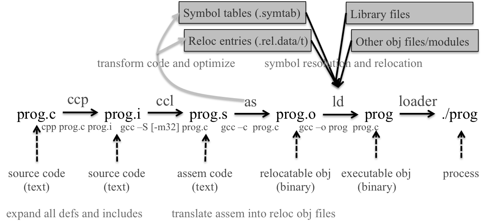
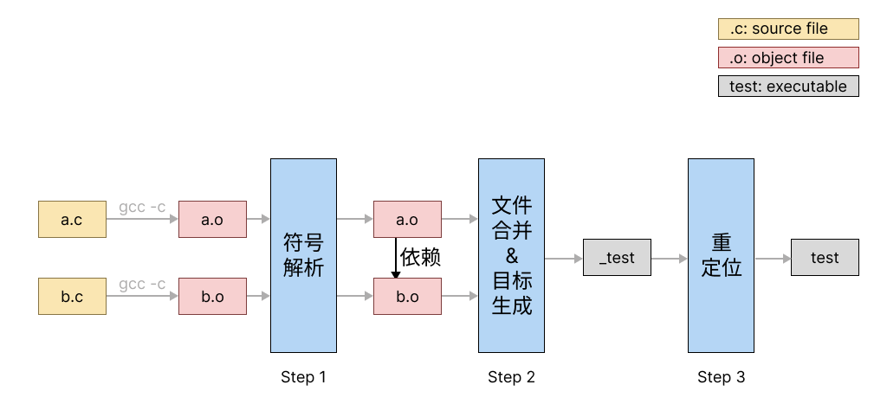
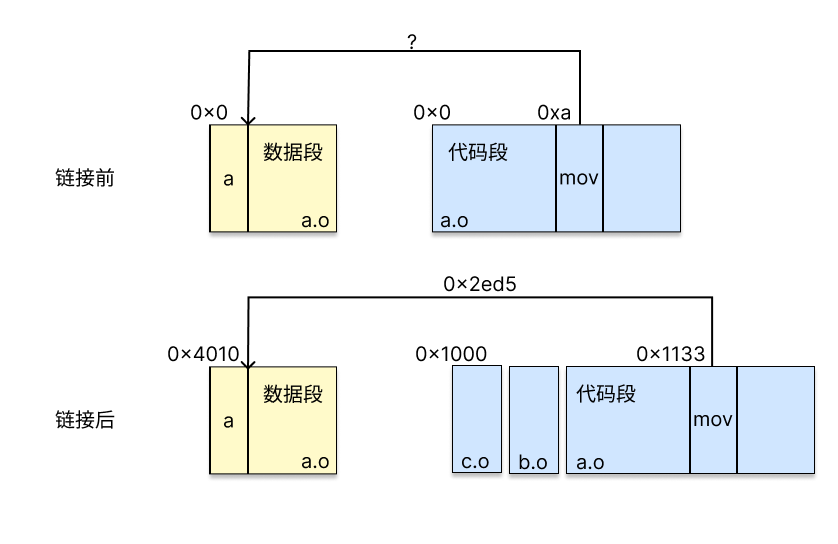
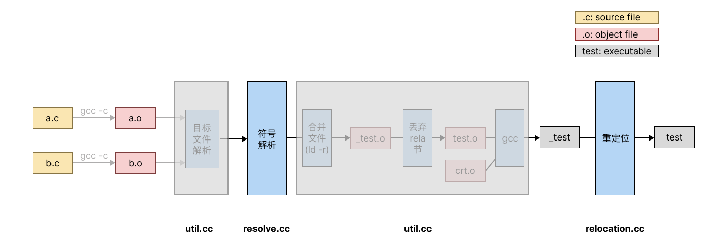
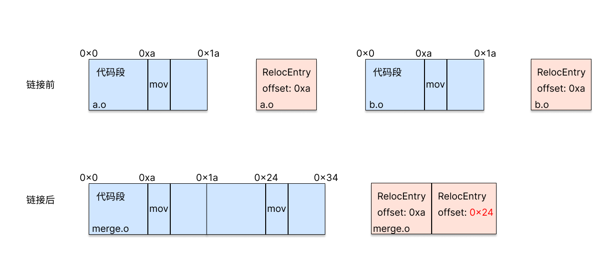

# XJTU-ICS Lab 6: Linker Lab

## 实验简介

在这个实验里，我们要求大家编写一个静态链接器（static linker），将汇编器（assembler）输出的每一个目标文件（object file）合成为一个可执行文件（executable，有时也称binary）。

本实验要求大家使用C++语言，使用实验框架提供的接口，在简单的测试用例上，完成静态链接中最关键的符号解析与重定位两部分，从而深入理解静态链接的具体流程。

## 注意事项

1. 本实验只经过了小范围测试，在代码/文档里出现问题或难以理解十分正常。当你认为某些部分不对劲时，请及时通过Piazza反馈。

2. 本实验使用C++标准库提供的数据结构简化开发。别害怕，这并不要求大家精通C++，在大部分时候你使用的仍然是熟悉的C语法，而我们会在必须使用C++语法时将用法告诉大家。

3. 这是一个重理解轻编程的实验：助教的参考解法只有不到150行的代码量（LoC）。然而这并不代表它非常简单，理解自己究竟要干什么仍然需要相当一段时间，所以请提早开始。

4. 实验的测试点最后两个测试点有已知的feature。通过先前的测试点后，你可能会发现最后两个测试点什么都不做就通过了。这是正常现象，我们鼓励大家积极思考测试点反映的真实代码情况，也欢迎（但不要求）大家思考为什么框架会有这样的feature，并在有兴趣的基础上提PR帮我们解决。

## 知识回顾

### 链接的位置

从源代码到计算机上运行的程序总共要经过如图示的以下过程：

在源代码被转化为目标文件（即`prog.o`）之前，要经过预处理器，编译器，汇编器的处理。

在本实验中，我们关心的则是从`prog.o`转化为`prog`的过程。在Linux系统上，这一过程通过调用系统提供的静态链接器`ld`实现。而我们需要做的事情就是对`ld`核心功能的模仿。

### 链接的目的

链接最本质的出发点是为源代码的**模块化**提供可以**相互引用的接口**。首先，让我们看看源代码为什么需要模块化。

模块化设计允许用户使用多个源文件形成可执行程序，例如下述的两个源文件：

```c
// a.c
static int var;
static void print_var()
{
	printf("The value of var is：%d\n", var);
}
void func_a() { print_var(); }
```

```c
// b.c
static int var;
static void print_var()
{
	printf("The value of var is：%d\n", var);
}
void func_b() { print_var(); }
```

不难发现，虽然两个源文件都定义了变量`var`与函数`print_var`，但最终两个`print_var`打印出的是不同的变量。而如果不存在模块化，只有这样才能维护两份不同的变量：

```c
// combine.c
int var_a;
int var_b;

void print_var_a()
{
	printf("The value of var_a is：%d\n", var_a);
}

void print_var_b()
{
	printf("The value of var_b is：%d\n", var_b);
}
```

从这个例子中我们可以发现，源代码的模块化在命名上提供了隔离，从而使得用户编程的限制减少了。

而分成多个模块的代码，终究要被合并而形成同一个程序。如果某个源文件与其它源文件之间只有隔离而不存在依赖，那么这个源文件在形成可执行文件时就是可以省略的。而源文件之间的依赖，是通过使用相同名字实现的，如将上述例子经过如下修改：

```c
// a.c
extern int var;
extern void print_var();
void func_a() { print_var(); }
```

```c
// b.c
int var;
void print_var()
{
	printf("The value of var is：%d\n", var);
}
void func_b() { print_var(); }
```

则`func_a`与`func_b`完成的任务完全一致。这是因为在最开始的版本中，我们使用`static`显式声明了对函数与变量的定义应当与其它源文件隔离；而在第二个版本中，我们使用`extern`显式声明了对函数与变量的定义应当绑定到其它源文件上。

此时回看我们在一开始的定义：为源代码的模块化提供可以相互引用的接口。是不是变得比较清晰了？链接的目的就在于解析每一个模块对外部函数与变量（二者一般合称为**符号**）的引用。

### 静态链接的主要流程

静态链接的主要流程如下图所示：


1. **符号解析**。如上文所述，链接器负责解析每个目标文件中所引用的外部符号。这一步执行的结果是为每个符号都恰好找到一个定义，对多重定义或没有定义的情况报错。

2. **文件合并与目标生成**。链接器接受的所有目标文件被合并为一个，并生成可执行文件。

3. **重定位**。修改生成的可执行文件代码，使代码访问的数据指向正确的位置。

其中，在这个实验中，我们关注过程1与过程3，下文具体解释如何完成这两个过程。

### 符号解析的流程

<!--
上文说到，某个目标文件可能引用一个来自外部文件的符号。而在二进制文件中，每个符号的具体信息被存储在符号表中，而符号表中的每个符号服从下述定义：

```c
// from elf.h
typedef struct
{
  Elf64_Word	st_name;		/* Symbol name (string tbl index) */
  unsigned char	st_info;		/* Symbol type and binding */
  unsigned char st_other;		/* Symbol visibility */
  Elf64_Section	st_shndx;		/* Section index */
  Elf64_Addr	st_value;		/* Symbol value */
  Elf64_Xword	st_size;		/* Symbol size */
} Elf64_Sym;
```

这些成员的具体含义如下：

- st_name：符号名字
- st_info：包含符号的类型（例如是函数还是变量），以及绑定信息（例如一个符号是全局还是局部的）
- st_other：符号的可见性，本实验中略
- st_shndx：符号的节下标
- st_value：符号距定义它的节的的起始位置的偏移
- st_size：符号的大小，本实验中略

例如，在命令行输入`ld a.o b.o`时，发生的事情如下：

1. 对`a.o`的每个外部引用，查找命令行中所有目标文件（即`b.o`）的符号表。
   1.1 对`b.o`符号表中的符号，检查：a）是否有符号与这个引用同名？b）这个同名符号是否是全局的？
    1.2 如果未找到，则报错：存在引用没有定义（undefined reference）
    1.3 如果找到多个满足条件的引用，则报错：存在引用被定义多次（multiple definition）
2. 对`b.o`的每个外部引用，查找命令行中所有目标文件（即`a.o`）的符号表。
3. 所有引用都恰好找到了一个定义，正常退出。

而目标文件中存储外部引用信息的结构如下：

```c
// from elf.h
typedef struct
{
  Elf64_Addr	r_offset;		/* Address */
  Elf64_Xword	r_info;			/* Relocation type and symbol index */
  Elf64_Sxword	r_addend;		/* Addend */
} Elf64_Rela;
```

这些成员的具体含义如下：

- r_offset：外部引用在其对应节里的偏移量。
- r_info：包含外部引用的类型以及对应符号在符号表中的下标。
- r_addend：外部引用在重定位时的加数，详见下文。

因此，可以通过外部引用的`r_info`，找到这个引用对应的符号表下标，从而找到这个引用对应的名字。
-->

<!--
在命令行输入`ld a.o b.o`时，发生的流程如下：

1. 对`a.o`的每个符号引用，查找命令行中所有目标文件的符号表。
   1.1 对`a.o`与`b.o`符号表中的符号，检查：a）是否有符号与这个引用同名？b）这个同名符号是否是全局的（体现在代码中，即为是否被`static`修饰）？c）这个同名符号是否有定义？
    1.2 如果未找到，则报错：存在引用没有定义（undefined reference）
    1.3 如果找到多个满足条件的引用，则报错：存在引用被定义多次（multiple definition）
2. 对`b.o`的每个外部引用，查找命令行中所有目标文件的符号表。
3. 所有引用都恰好找到了一个合法定义，正常退出。

在代码中如何访问目标文件的外部引用以及符号表详见下一节。
-->

根据课本上的定义，符号解析的过程是判断是否每个引用都恰好绑定到了一个符号上。而多个目标文件的符号应当服从以下原则：

1. 强符号只能有一个；
2. 存在一个强符号与若干个弱符号时，弱符号应当被绑定到强符号上；
3. 只存在若干个弱符号时，所有弱定义应当被绑定到任一一个弱符号上，且所有定义都绑定到这个符号上。

强符号包括：函数定义，全局变量定义。

弱符号包括：函数声明，全局变量声明。

### 重定位的流程

在目标文件编译完成时，如果存在对符号的引用，其代码中会存在空地址，等待被填上，例如：

```c
int a = 1;

int main()
{
    a = 2;
    return a;
}
```

形成的目标文件的汇编代码为：

```
Disassembly of section .text:

0000000000000000 <main>:
   0:   f3 0f 1e fa             endbr64 
   4:   55                      push   %rbp
   5:   48 89 e5                mov    %rsp,%rbp
   8:   c7 05 **00 00 00 00** 02    movl   $0x2,0x0(%rip)        # 12 <main+0x12>
   f:   00 00 00 
  12:   8b 05 **00 00 00 00**       mov    0x0(%rip),%eax        # 18 <main+0x18>
  18:   5d                      pop    %rbp
  19:   c3                      retq
```

注意被星号包围的位置即为`a`的地址。在形成目标文件时，`a`的地址仍不确定，这是因为CPU使用PC相对引用访问`a`的地址，详见下图：


如图所示，在链接前，汇编器并不知道链接器最终形成的可执行文件有多大，自然无法知道某条指令和其访问的数据的具体偏移量，因此只能留空。而这个偏移量只有在完成上文所述的链接过程的第二步，即目标文件合并之后才能完成。

因此，重定位的过程，其实就是在代码中的这些空缺填入正确地址，使其能正确地访问对应变量的过程。因为其修改代码的过程，静态链接器又被称为链接-编辑器（link-editor）。

### ELF文件与节（Section）

目标文件采用ELF格式组织，因其充满了实现细节与历史包袱，实验框架已全力为大家隐藏，因此大家无需了解其实现细节。然而仍有一点概念需要注意，即ELF文件按功能分为不同的节（section），常用的节有存放代码的节（.text），存放有初值全局变量的节（.data），存放无初值全局变量的节（.bss）等等。下文`关键数据结构`中将会详细介绍在我们的代码框架中如何体现一个节。

可以使用`readelf -S`来显示目标文件的所有节，此处略。

## 开始实验

### 实验框架

实验框架的工作流程如图所示：

其中，大家需要完成的部分需要实现在`resolve.cc`以及`relocation.cc`中。`util.cc`完成了链接过程中的其它任务，用灰色框标出，大家无需关注。

`main.cc`负责调用这三个文件中提供的函数，完成整体流程。

### 关键数据结构

为了简化大家的工作量，实验框架完成了从二进制目标文件中读取符号表等一系列结构的过程，并将其存入C++数据结构中，方便大家使用，即上图中“目标文件解析”。下文将逐个介绍这些数据结构，及其在链接过程中对应的组成部分。

#### ObjectFile

用来存储目标文件中所需的信息，其包含的成员变量及其含义如下：

- symbolTable ：目标文件的符号表，保存其每一个符号（见下文Symbol）
- relocTable ：目标文件的重定位表，保存其每一个重定位条目（见下文RelocEntry）
- sections ：目标文件的节表，保存节名string到节的映射（见下文Section）
- sectionsByIdx ：目标文件的节表，保存节索引index到节指针Section*的映射
- baseAddr ：目标文件在内存中的起始地址，详见test0
- size ：目标文件的大小

#### Section

用来存储目标文件中的一个节，其包含的成员变量及含义如下：

- name ：节名称
- type ：节类型，在本实验中略
- flags ：节标志，在本实验中略
- info ：节附加信息，在本实验中略
- index ：节下标
- addr ：节的起始地址
- off ：节在目标文件中的偏移量
- size ：节大小
- align ：节在目标文件中的对齐限制

关于type和flags的详细信息可参考[ELF文件的man手册中有关Shdr的部分](https://www.man7.org/linux/man-pages/man5/elf.5.html#:~:text=Section%20header%20(Shdr))。

#### Symbol

用来存储目标文件中的一个符号，其包含的成员变量及含义如下：

- name ：符号名称，为string类型。
- value ：符号值，表示符号在其所属节中的偏移量。
- size ：符号大小，当符号未定义时则为0
- type ：符号类型，例如符号是变量还是函数
- bind ：符号绑定，例如符号为全局或局部的
- visibility ：符号可见性，本实验中略
- offset ：符号在目标文件中的偏移量
- index ：符号相关节的节头表索引

#### RelocEntry

用来存储目标文件中的一个引用产生的重定位条目，其包含的成员变量及含义如下：

- sym ：指向与该重定位条目关联的符号Symbol的指针
- name ：重定位条目关联的符号名称，类型为string
- offset ：重定位条目在节中的偏移量
- type ：重定位条目类型
- addend ：常量加数，用于计算要存储到可重定位字段中的值

#### allObject

用来存储所有目标文件对应的`ObjectFile`数据结构。

#### mergedObject

所有目标文件合并为一个后对应的`ObjectFile`。


### 任务

完成`resolve.cc`与`relocation.cc`中的空函数，完成符号解析与重定位。

对于前者，需要检查每个`ObjectFile`的每个`RelocEntry`，检查所有`RelocEntry`是否都已经找到定义，或在多个目标文件中被定义。在发生错误时，返回相应的返回值，并结束程序。在确保符号解析正确后，将`RelocEntry`的`sym`指向提供定义的`Symbol`，表示完成了“绑定”。

> 这一步的本质是对输入的目标文件进行检查。
> {.is-info}


对于后者，需要对每个`ObjectFile`的每个`RelocEntry`，在其指示的offset处填入代码地址与访问符号地址的偏移，再加上addend，从而完成重定位。

如前文所述，由于在链接过程中若干个目标文件被合成为一个，因此在填入地址的过程中，需要首先重新调整`RelocEntry`的`offset`字段，如下图所示：


在多个目标文件被合并后，`RelocEntry`的offset（即需要填入的地址）发生了改变。此时需要根据`allObject`中各个`ObjectFile`的代码段长度进行调整。

> 这一步的本质是向文件的特定位置写入，即将修改合并后的目标文件中代码中留空的部分指向正确的地址。
> {.is-info}

### 运行

本实验回到`x86.ics.xjtu-ants.net`上运行。

首先，将仓库从GitHub clone下来：

```bash
$ git clone https://github.com/Qcloud1223/ics-ld-public
```

按如下方法编译运行：

```bash
mkdir build
cd build
cmake -DCMAKE_BUILD_TYPE=Debug ..
cd ..
make
```

可以使用`make test*`的方法单独对某个测试点进行测试，如`make test0`。

如果需要debug，可以在autograder输出的命令之前加上`gdb --args`，如：

```bash
$ gdb --args ./build/ics-linker testcases/test0/glbvar.o -o testcases/test0/test0.o
```

## 测试点介绍

### test 0

在此测试点中只需完成重定位。且因为只有一个源文件（即`allObject`的长度为1），因此无需在其它文件的符号表中查询。

完成重定位需要对`relocTable`进行遍历，对每个`RelocEntry`，首先需要找到其对应的`symbol`的地址，这个值存放在`re.sym->value`里。

由于`relocTable`的类型为`std::vector`，可以使用以下方法遍历它：

```c++
for (auto &re : obj.relocTable) {
	re.sym = ...
  re.name = ...
}
```

随后，我们需要知道`RelocEntry`指示的需要修改的源代码的位置，这个值由`re.offset`指示。而由于当前object在链接成可执行文件时，还包含若干其它.o，所以需要加上`textOff`，才能得到真正需要修改的地址。

> 注意 `textOff` 和 `textAddr` 的区别：`textOff` 是指 `.text` 节在 ELF 文件中存储的位置，而 `textAddr` 是指 `.text` 节被运行时加载后在内存中所处的位置。
> {.is-info}

然后是需要往这个地址内填入什么内容。通过`re.type`发现，此时的重定位类型为2，即`R_X86_64_PC32`。这种重定位类型代表上文提到的PC相对寻址，即根据当前指令寄存器（`$rip`）的位置与变量的偏移量进行访问。此时需要填入的地址为变量的地址减去`RelocEntry`的offset，再加上`addend`，即上文中的`re.sym->value - (re.offset + textAddr) + re.addend`。

在实验框架中，我们使用 `mmap` 系统调用 (memory-mapped file IO) 将文件映射至内存中的某段虚拟地址（记为 `[baseAddr, baseAddr+fileSiz)`），从这段地址可以读到磁盘中文件的内容，对这段地址的写入也会最终反映在磁盘上的文件中。举例来讲，如果我们想要向文件的第`0x1000`字节处写入内容，而文件的`baseAddr`为`0x555555555000`，则最后你应当向虚拟地址`0x555555556000`写入。`mergedObject`中`baseAddr`就指示了合并后的目标文件在内存中的基地址。

> Debug建议：一个较为安全的做法是在向内存写入之前，把即将写入的位置打印出来。
> 一般来说，很小的数（如`0x1133`）不是一个合法的地址，而合法地址应当长得像`0x400000`，`0x555555000000`或`0x7ffffffffde8`这样。
> {.is-warning}

在C++中，向一个地址填入内容需要进行显式类型转换，方法如下：

```c++
uint64_t addr = 0x555555555000;
int valueToFill = 42;
*reinterpret_cast<int *>(addr) = valueToFill;
```

你可能会在两个地方碰见segmentation fault：1）尝试向文件写入时；2）尝试执行经自己重定位后的可执行文件时。autograder在面对这两种情况时，会提示碰到问题的到底是linker还是经过链接之后的程序在出错。

对于前者，建议使用gdb观察出问题的代码位置，以及检查是否在向一个合法的地址写入。

对于后者，此时你的linker正确退出了，但linker输出的结果不对。此时建议使用`objdump`检查经过重写之后的程序是否能够对上预期输出（注意星号部分）。

test0的预期输出为：

```bash
$ objdump -d testcases/test0/test0 | grep '<main>:' -A 11
0000000000001129 <main>:
    1129:       f3 0f 1e fa             endbr64 
    112d:       55                      push   %rbp
    112e:       48 89 e5                mov    %rsp,%rbp
    1131:       c7 05 **d5 2e 00 00** 02    movl   $0x2,0x2ed5(%rip)        # 4010 <a>
    1138:       00 00 00 
    113b:       8b 05 **cf 2e 00 00**       mov    0x2ecf(%rip),%eax        # 4010 <a>
    1141:       5d                      pop    %rbp
    1142:       c3                      retq   
    1143:       66 2e 0f 1f 84 00 00    nopw   %cs:0x0(%rax,%rax,1)
    114a:       00 00 00 
    114d:       0f 1f 00                nopl   (%rax)

```

### test 1

在此测试点中你仍然只需完成重定位，且仍只有一个源文件。不同的地方在于，此时重定位类型从`R_X86_64_PC32`变成了`R_X86_64_32`：

```
Relocation section '.rela.text' at offset 0x260 contains 2 entries:
  Offset          Info           Type           Sym. Value    Sym. Name + Addend
000000000029  00090000000a R_X86_64_32       0000000000000000 array + 0
00000000002e  000a00000004 R_X86_64_PLT32    0000000000000000 sum - 4
```

这代表着此时可执行文件以非PIE（position independent executable）形式编译，通过一个绝对地址而非PC相对访问。在这种情况下，你需要填入地址的位置不变，而需要填入的内容变成了`re.sym`的`value`再加上addend。在代码框架中，`handleRela`接受的参数`isPIE`用来指示当前链接的目标文件是否启用了PIE。

> 想一想：为什么`R_X86_64_32`对应的addend为0，而`R_X86_64_PC32`不是？addend有什么实际意义？
> {.is-info}

此外，由于我们使用一个函数访问了另一个函数，引入了另一种重定位类型`R_X86_64_PLT32`。它也使用PC相对寻址，所以在处理时与`R_X86_64_PC32`完全一样。

预期输出：

```bash
$ objdump -d testcases/test1/test1 | grep 00401126 -A 8
0000000000401126 <main>:
  401126:       f3 0f 1e fa             endbr64 
  40112a:       55                      push   %rbp
  40112b:       48 89 e5                mov    %rsp,%rbp
  40112e:       bf 28 40 40 00          mov    $0x404028,%edi
  401133:       e8 ce ff ff ff          callq  401106 <sum>
  401138:       5d                      pop    %rbp
  401139:       c3                      retq   
  40113a:       66 0f 1f 44 00 00       nopw   0x0(%rax,%rax,1)
```

### test 2

在这个测试点中需要进行符号解析。显然，`extcall.c`访问了一个外部符号，但没有任何一个源文件提供了它的定义，因此需要在`callResolveSymbols`中将`errSymName`设为未找到引用的符号名字，并返回`NO_DEF`。

要做到这一点，需要对每一个`ObjectFile`的每一个`RelocEntry`，检查其是否在某一目标文件的`symbolTable`中存在强定义。如上文中所述，一个强定义应当满足：

1. 名字匹配。即Symbol的`name`与`RelocEntry`的`name`相同（`RelocEntry`的`name`应当从其对应的`sym`中找到）；
2. 能被其它目标文件发现。即Symbol的`bind`为`STB_GLOBAL`；
3. 存在初值。即`Symbol`的`index`不为`SHN_UNDEF`或`SHN_COMMON`。

---

如果你的代码没能发现存在一个未解析的引用，`ld`会报错从而终止程序。

预期输出：（你的报错应当先出现从而退出程序，不应看到`ld`的输出）

```
$ ./build/ics-linker testcases/test2/extcall.o -o testcases/test2/test2.o
undefined reference for symbol foo
Aborted (core dumped)
```

### test 3

在这个测试点中需要发现存在多个定义的符号。如果一个符号存在多个强定义，则设置`errSymName`为被多次定义的符号名，并返回`MULTI_DEF`。

预期输出：（你的报错应当先出现从而退出程序，不应看到`ld`的输出）

```
$ ./build/ics-linker testcases/test3/multidef1.o testcases/test3/multidef2.o -o testcases/test3/test3.o
multiple definition for symbol a
Aborted (core dumped)

```

### test 4

在这个测试点中，存在同名的一个强与一个弱符号。根据上文中的定义，对弱符号的引用将被绑定到强符号上，因此这一测试点应当能够链接成功，表现为来自两个文件中的函数对同名变量的操作映射到了同一个内存地址，即`weakdef.c中`的`foo`函数对`a`的修改在`strongdef.c`中也可见，因此`strongdef.c`中的`main`函数应返回2。

具体操作是，两个`ObjectFile`中的`RelocEntry`的`sym`字段，指向了同一个强`Symbol`。

一个弱定义应当满足：

1. 名字匹配。同test 2。
2. 能被其它文件发现。同test 2。
3. 不存在初值。即`Symbol`的`index`为`SHN_COMMON`。

预期输出：

```bash
$ objdump -d testcases/test4/test4 | grep '<foo>:' -A 8
0000000000001143 <foo>:
    1143:       f3 0f 1e fa             endbr64 
    1147:       55                      push   %rbp
    1148:       48 89 e5                mov    %rsp,%rbp
    114b:       c7 05 bb 2e 00 00 02    movl   $0x2,0x2ebb(%rip)        # 4010 <a>
    1152:       00 00 00 
    1155:       90                      nop
    1156:       5d                      pop    %rbp
    1157:       c3                      retq
$ objdump -d testcases/test4/test4 | grep '<main>:' -A 8
0000000000001129 <main>:
    1129:       f3 0f 1e fa             endbr64 
    112d:       55                      push   %rbp
    112e:       48 89 e5                mov    %rsp,%rbp
    1131:       b8 00 00 00 00          mov    $0x0,%eax
    1136:       e8 08 00 00 00          callq  1143 <foo>
    113b:       8b 05 cf 2e 00 00       mov    0x2ecf(%rip),%eax        # 4010 <a>
    1141:       5d                      pop    %rbp
    1142:       c3                      retq
$ testcases/test4/test4
$ echo $?
2
```

注意两处注释中a符号的地址相同。

值得注意的是，从这个测试点开始涉及多个目标文件合并后的重定位，所以在进行重定位之前（即`handleRela`的最开始）必须调整每个`ObjectFile`中每个`RelocEntry`的`offset`（详见`任务`节中图）。如果你看到如下的输出，说明你没有完成这个步骤：

```bash
0000000000001129 <main>:
    1129:       f3 0f 1e fa             endbr64 
    112d:       55                      push   %rbp
    112e:       48 89 e5                mov    %rsp,%rbp
    1131:       b8 00 d5 2e 00          mov    $0x2ed500,%eax
    1136:       00 08                   add    %cl,(%rax)
    1138:       00 00                   add    %al,(%rax)
    113a:       00 8b 05 cf 2e 00       add    %cl,0x2ecf05(%rbx)
    1140:       00 5d c3                add    %bl,-0x3d(%rbp)
```

使用`sections[".text"]`来访问每个目标文件的代码段，从中可以获得其大小。

### test 5

这一测试点中，所有对符号a的定义都是弱定义。此时编译也应当能通过，并且两个弱符号仍指向同一个地址。main.c中main函数应当返回3。

预期输出：

```bash
$ objdump -d testcases/test5/test5 | grep '<main>:' -A 8
0000000000001129 <main>:
    1129:       f3 0f 1e fa             endbr64 
    112d:       55                      push   %rbp
    112e:       48 89 e5                mov    %rsp,%rbp
    1131:       c7 05 d9 2e 00 00 01    movl   $0x1,0x2ed9(%rip)        # 4014 <a>
    1138:       00 00 00 
    113b:       b8 00 00 00 00          mov    $0x0,%eax
    1140:       e8 12 00 00 00          callq  1157 <set_a1>
    1145:       b8 00 00 00 00          mov    $0x0,%eax
$ objdump -d testcases/test5/test5 | grep '<set_a1>:' -A 8
0000000000001157 <set_a1>:
    1157:       f3 0f 1e fa             endbr64 
    115b:       55                      push   %rbp
    115c:       48 89 e5                mov    %rsp,%rbp
    115f:       c7 05 ab 2e 00 00 02    movl   $0x2,0x2eab(%rip)        # 4014 <a>
    1166:       00 00 00 
    1169:       90                      nop
    116a:       5d                      pop    %rbp
    116b:       c3                      retq
$ objdump -d testcases/test5/test5 | grep '<set_a2>:' -A 8
000000000000116c <set_a2>:
    116c:       f3 0f 1e fa             endbr64 
    1170:       55                      push   %rbp
    1171:       48 89 e5                mov    %rsp,%rbp
    1174:       c7 05 96 2e 00 00 03    movl   $0x3,0x2e96(%rip)        # 4014 <a>
    117b:       00 00 00 
    117e:       90                      nop
    117f:       5d                      pop    %rbp
    1180:       c3                      retq
$ testcases/test5/test5
$ echo $?
3
```

注意三处注释中a符号的地址相同。


## 评分方法与代码提交

使用autograder评估你的代码得分。为防止大家针对测试点做hard code，后续计分会使用类似如下的策略实现：

以test 0为例：

```c
int a = 1;

int main()
{
    asm volatile("nop 16");
    a = 2;
    return a;
}
```

其重定位结束之后的结果应为：

```bash
0000000000001129 <main>:
    1129:       f3 0f 1e fa             endbr64 
    112d:       55                      push   %rbp
    112e:       48 89 e5                mov    %rsp,%rbp
    1131:       0f 1f 04 25 10 00 00    nopl   0x10
    1138:       00 
    1139:       c7 05 cd 2e 00 00 02    movl   $0x2,0x2ecd(%rip)        # 4010 <a>
    1140:       00 00 00 
    1143:       8b 05 c7 2e 00 00       mov    0x2ec7(%rip),%eax        # 4010 <a>
    1149:       5d                      pop    %rbp
    114a:       c3                      retq   
    114b:       0f 1f 44 00 00          nopl   0x0(%rax,%rax,1)
```

不难发现，因为`main`中被插入了长度为16字节的`nop`，对`a`的引用的位置变了，因此重定位过程中需要填入的地址也就发生了变化。在最终给分时我们会动态调整`nop`的长度，从而使大家很难通过硬编码地址的方法通过各个测试点。同时，因为重定位类型和方法没有发生变化，所以只要你填入的地址是自己算出来的，而不是根据预期输出硬编码进去的，就不会受此影响。

为了让大家能够参考预期输出，我们不再修改框架中原有的testcase。请大家手动构造这样的测试点（使用`gcc -c`或`gcc -c -fno-pie`编译，详见`Makefile`），确保提交的代码能够通过最终给分的autograder。

---

迟交策略与提交平台同之前的lab。

提交`make submit`输出的zip文件。

## 写在最后

链接是一个相当高深且复杂的过程。下文只列举几个话题，供有兴趣的同学探索：

1. 实验流程图中的右侧灰色框部分是我们hack了`ld`，使它帮我们完成了目标文件合并，但又省略了重定位，从而强迫大家来完成这个过程：）。

2. 系统的静态链接器`ld`允许用户通过脚本（linker script）的形式指定目标文件被链接时的行为。具体地，用户可以调整在可执行文件中，各个节的相对位置，以及每个目标文件的节的相对位置。

3. 静态链接过程中可能会做链接时优化（LTO），使得跨源文件的函数inline变得可能，可能使程序性能获得不少提升。

4. 动态链接将部分链接时发生的任务推迟到了程序控制流交给用户之前。这种设计带来了一个宝贵的特性，即允许用户进行”打桩“（详见课本7.13），在不修改代码的前提下改变程序中某些函数的定义，进而使用户可以无需应用的源码，就可以定制应用的行为。对动态链接/加载器感兴趣的同学，可以参考[往年ICS的final lab](https://github.com/Qcloud1223/COMP461905)：动态加载器。
